<p align="center">
  
</p>

<p align="center">
  <a href="https://developerAyesha-psi.vercel.app"></a>
  <a href="https://linkedin.com/in/developerAyesha"></a>
  <a href="https://leetcode.com/developerAyesha"></a>
  <a href="mailto:developerAyesha@gmail.com"></a>
</p>

<p align="center">
  
</p>

---

##  About Me

<table>
<tr>
<td width="55%" valign="top">

### Hi, I'm Ayesha! 👋

**Software Engineer & Team Lead** at **Developer Tag**

I'm passionate about building production systems that scale and solving complex problems with elegant solutions.

  

</td>
<td width="45%" align="center">


</td>
</tr>
</table>

### 🎯 What I Do

<table>
<tr>
<td width="50%">

<h4>🚀 Full-Stack Development</h4>

Building end-to-end applications with modern frameworks

`Next.js` `React` `Node.js` `PostgreSQL` `MongoDB`

</td>
<td width="50%">

<h4>🤖 AI & Machine Learning</h4>

Integrating intelligent systems into production apps

`LangChain` `LangGraph` `RAG` `OpenAI` `Vector DBs`

</td>
</tr>
<tr>
<td width="50%">

<h4>☁️ Cloud & DevOps</h4>

Deploying and scaling infrastructure on the cloud

`AWS` `Docker` `CI/CD` `Microservices` `Kubernetes`

</td>
<td width="50%">

<h4>👥 Team Leadership</h4>

Guiding teams to deliver high-quality software

`Code Reviews` `Architecture` `Mentoring` `Agile`

</td>
</tr>
</table>

### 💡 Current Focus

```typescript
const currentWork = {
  building: "Scalable SaaS platforms with AI integration",
  exploring: "Advanced LLM orchestration with LangGraph",
  improving: "System design & distributed architectures",
  sharing: "Knowledge through mentoring & code reviews"
};
```

---

### 🛠️ Tech Stack

<p align="center">
  
</p>

<details>
<summary><b>📋 View Full Stack Details</b></summary>
<br/>

| Category | Technologies |
|----------|-------------|
| **Frontend** | React, Next.js, TypeScript, TailwindCSS, Redux |
| **Backend** | Node.js, Express, Python, FastAPI, GraphQL |
| **Database** | PostgreSQL, MongoDB, Redis, Prisma |
| **AI/ML** | LangChain, LangGraph, OpenAI, RAG, Vector DBs |
| **Cloud** | AWS (EC2, S3, Lambda), Docker, GitHub Actions |
| **Tools** | Git, VS Code, Postman, Figma |

</details>

---

### 📊 Languages

<p align="center">
  
</p>

---

### 📈 GitHub Stats

<p align="center">
  
  
</p>

<p align="center">
  
</p>

---

### 🤝 Let's Connect

<p align="center">
I build reliable software and mentor engineers.<br/>
If you have a challenging platform problem or want to discuss AI + product, let's talk.
</p>

<p align="center">
  
</p>

<p align="center"><b>Passion + Precision = Innovation</b></p>